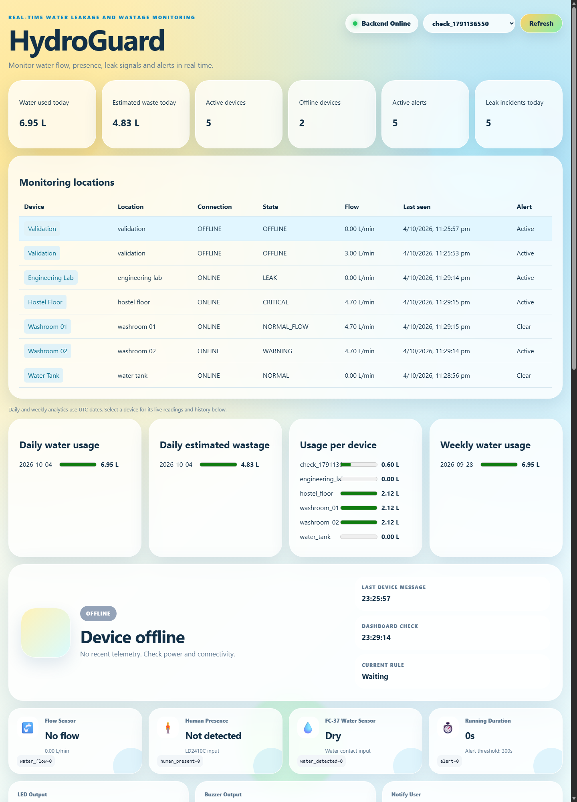

# HydroGuard

Real-Time Water Leakage and Wastage Monitoring System, built from the Smart Hydro Alert IoT prototype. A manageable final-year B.Tech project using deterministic rules, multiple ESP32 devices, MQTT, FastAPI, MongoDB and React. It runs without hardware using the MQTT simulator.

## Problem statement

Forgotten taps, unattended flow and leaks waste water across washrooms, laboratories, hostel floors and tank areas. HydroGuard separates normal use from unattended flow and water contact, records incidents and estimates measured usage per location.

## Architecture

```text
Flow Sensor ---+
Presence ------+--> ESP32 or Python simulator
Leak Sensor ---+            |
                            | MQTT: home/{location}/{device_id}/sensor
                            v
                      Mosquitto Broker
                            |
                            v
                         FastAPI
                        /   |   \
                       /    |    \
                 MongoDB  Telegram  WebSocket
                       \            /
                        \          /
                         React dashboard
                         Usage analytics

Optional: FastAPI -> MQTT command -> ESP32 -> solenoid valve
```

One backend handles telemetry, device health, rules, alerts and analytics. Docker builds the React bundle automatically. Local nginx proxies REST and WebSockets; the Render Docker image serves React directly from FastAPI with the same origin.

## Tech stack and hardware

Python 3.11+, FastAPI, Pydantic, Beanie/Motor, MongoDB 7, aiomqtt, Eclipse Mosquitto 2, React 19, Vite, nginx and Docker Compose. Charts use native HTML meters without another dependency. Use Node 22.13+ or 24+ for frontend development.

Optional hardware: ESP32, calibrated YF-S201 flow sensor, LD2410C presence sensor, FC-37 water-contact sensor, OLED, LEDs and buzzer. A solenoid valve is optional. FC-37 detects water contact; it cannot measure litres.

## MQTT communication

Existing hardware topics remain supported:

```text
home/{location}/{device_id}/sensor
home/{location}/{device_id}/status
home/{location}/{device_id}/alert
```

The backend validates message size, Pydantic schema, topic/device agreement and timestamp skew. Stale retained heartbeats are ignored when reconnecting, and retained alert commands are not replayed. Device IDs use letters, digits, underscores or hyphens (1-32 characters). Timestamps are Unix seconds; sensor telemetry also accepts timezone-qualified ISO-8601 strings.

```json
{
  "device_id": "washroom_01",
  "timestamp": "2026-10-04T12:00:00Z",
  "water_flowing": true,
  "flow_rate_lpm": 0.8,
  "human_present": false,
  "leak_detected": false
}
```

Legacy `water_flow` and `water_detected` fields remain accepted. Location comes from the MQTT topic unless configured through registration. Register a friendly name with `POST /api/devices/register`. Each device has independent last-seen, timer, flow and alert state. Duplicate and out-of-order telemetry is rejected before volume calculation. Use at least a one-second publishing interval because timestamps have second resolution.

## Backend logic and state machine

Business logic lives in `app/services`, with one serialized ingestion path shared by REST and MQTT. Connection age uses server receipt time. Offline checks run periodically; messages restore online state automatically. Unattended timers reset when normal use resumes or after an offline gap. MQTT uses real elapsed time; the public demo can accelerate only the unattended timer using `DEMO_TIME_SCALE`.

| State | Rule | Severity |
|---|---|---|
| NORMAL | No flow and no water contact | INFO |
| NORMAL_FLOW | Flow with human presence | INFO |
| WARNING | Unattended flow below threshold | WARNING |
| WASTAGE_ALERT | Unattended flow reaches threshold (default 300 s) | HIGH |
| LEAK | Water contact without substantial flow | HIGH |
| CRITICAL | Water contact and substantial flow | CRITICAL |
| OFFLINE | No message for timeout (default 60 s) | WARNING |

`CRITICAL_FLOW_RATE_LPM` defaults to 0.3. Legacy devices that report flow without a numeric rate retain their critical flow/contact behavior. `ALERT` is accepted as a legacy input alias for `WASTAGE_ALERT`.

## Usage and incident analytics

```text
water volume (L) = previous flow rate (L/min) * elapsed seconds / 60
```

The previous reading represents the interval until the next sample. Unattended measured flow is tracked separately as estimated wastage. No volume is invented before the first sample, after the last sample, or across a gap greater than the offline timeout. Rates of zero or absent measurements contribute zero litres. Intervals crossing midnight are split between UTC days. Weekly buckets begin Monday (UTC).

Volumes are stored with telemetry and aggregated in MongoDB, rather than duplicated into another collection. Incident counts are state entries rather than every sample or repeated notification. Dashboard cards show today's used/wasted litres, online/offline devices, active alerts and leak/critical incidents. Charts show daily usage, daily wastage, usage by device and weekly usage. Clicking a device opens its existing live readings and history below the overview.

## Alerts

Warnings, wastage, leaks, critical conditions and offline events are persisted. There is one record per active episode. Identical notifications for a device/state are suppressed for `ALERT_COOLDOWN_SEC` (default 300 s); a severity increase bypasses cooldown. Notification attempts are recorded even if Telegram is unavailable, preventing retry floods. A state change resolves obsolete alerts and emits `ALERT_RESOLVED`. Acknowledgement records an operator response; it does not clear the physical condition. Telegram credentials are optional.

Admin endpoints use `X-API-Key`; local development without a configured key is allowed. Never embed the admin key in a frontend build. Public demo actions are restricted to `DEMO_DEVICE_ID`, fixed scenarios and a rate limit, and do not send Telegram notifications or valve commands.

## Database design

- `devices`: unique device ID, friendly name, location, current readings, connection state, receipt time, firmware, timer and alert cooldown history.
- `sensor_logs`: validated telemetry, state, interval volume segments and incident-entry flag. Unique compound device/timestamp index prevents duplicate integration.
- `alerts`: unique alert ID, device, type, severity, message, timestamp, acknowledgement, resolution and notification outcome. Device/status/time and severity/acknowledgement indexes support common queries.

Existing collection names are retained to preserve the architecture. A new database named `hydroguard` is configured on Render. No migration of old deployment data is performed.

## API overview

| Method | Route | Purpose |
|---|---|---|
| GET | /health | Backend health |
| GET | /api/system | Non-secret public configuration |
| GET | /api/devices | All devices and readings |
| POST | /api/devices/register | Register/update name and location (admin) |
| GET | /api/devices/{id}/live | Latest state |
| GET | /api/devices/{id}/history | Device telemetry with time filters |
| POST | /api/devices/{id}/simulate | Validated arbitrary telemetry (admin) |
| POST | /api/devices/{id}/reset | Reset state; optionally clear history (admin) |
| GET | /api/alerts | Filtered alert history |
| POST | /api/alerts/{alert_id}/acknowledge | Acknowledge (admin) |
| GET | /api/analytics/summary | Global usage, devices and incident counts |
| GET | /api/analytics/devices | Volume by device |
| GET | /api/analytics/devices/{id} | Device summary |
| GET | /api/analytics/daily | UTC daily buckets; optional device_id/days |
| GET | /api/analytics/weekly | Monday weekly buckets; optional device_id/weeks |
| POST | /api/demo/devices/{id}/scenario/{scenario} | Fixed public demo |
| POST | /api/demo/devices/{id}/reset | Public demo reset |
| WS | /ws/dashboard | All-device events |
| WS | /ws/devices/{id} | Device events |

WebSocket messages retain the legacy `event` field and add a `type` such as `DEVICE_TELEMETRY_UPDATED`, `DEVICE_STATUS_CHANGED`, `DEVICE_OFFLINE`, `NEW_ALERT`, `ALERT_RESOLVED`, or `ALERT_ACKNOWLEDGED`. The frontend refreshes its data automatically when events arrive and reconnects when disconnected. Interactive API docs: `/docs`.

## Running with Docker

```powershell
Copy-Item .env.example .env
docker compose up --build
```

Dashboard: http://localhost:3000. Backend and bundled dashboard: http://localhost:8000. MongoDB and MQTT are included; no manual frontend build is required. The local broker permits anonymous connections for development.

In another terminal, start five devices at distinct locations with different states:

```powershell
docker compose --profile tools run --rm simulator multi --count 5 --duration 360
```

## Simulator usage

```powershell
python -m venv .venv
.venv/Scripts/python -m pip install -r requirements.txt
.venv/Scripts/python -m simulator unattended_flow --device washroom_01 --location washroom_01 --duration 360
.venv/Scripts/python -m simulator critical_leak --device tank_01 --location water_tank --duration 60
.venv/Scripts/python -m simulator device_offline --device lab_01 --duration 90
.venv/Scripts/python -m simulator multi --count 5 --duration 360
```

Named scenarios: `normal`, `normal_usage`, `unattended_flow`, `leak`, `critical_leak`, `device_offline`; `intermittent` remains available. Offline mode announces the device, sends one measurement and stops publishing so the timeout can be observed. The simulator listens for optional valve commands and publishes an acknowledgement after closing its simulated flow. Use `--tick 1` or greater.

For a quick wastage demonstration, set `ALERT_DURATION_THRESHOLD_SEC=10` locally and restart the backend. This changes the threshold, rather than falsifying water usage time.

## Development and checks

Start MongoDB/Mosquitto with Docker, then:

```powershell
.venv/Scripts/python -m uvicorn app.main:app --reload
cd frontend-react
npm ci
npm run dev
```

Vite proxies REST and WebSockets to localhost:8000. Open http://localhost:5173. Configure `VITE_API_BASE` only when using a separate backend origin.

```powershell
.venv/Scripts/python -m pytest
.venv/Scripts/python -m ruff check app simulator tests
.venv/Scripts/python -m black --check app simulator tests
cd frontend-react
npm run lint
npm run build
```

Optional integration tests use `pip install mongomock-motor`; they exercise MQTT message handling, MongoDB model persistence, API analytics, acknowledgement and WebSocket events with an in-memory database. Run `pytest tests/test_integration.py`. Run `.venv/Scripts/python scripts/check_stack.py` against a running Docker stack to check the real broker, database, HTTP frontend and WebSocket proxy. This creates separate `check_*` devices.

## Fresh Render deployment

The new `render.yaml` points to `AsmiSriva20/HydroGuard`, branch `main`, service name `hydroguard`. It does not update or delete the previous Smart Hydro Alert service.

1. Push this repository to GitHub.
2. In Render, create a new Blueprint from HydroGuard. Render builds the root Dockerfile and serves the frontend and API together.
3. Set `MONGO_URI` to a reachable MongoDB Atlas URI, with a database user and network access configured. Keep secrets in Render environment settings. The Blueprint generates a new admin key.
4. Test the new URL, `/health`, `/docs`, demo states and charts.
5. Remove the previous service through its Render settings once the new service works. Check that its MongoDB database is not shared before deleting any old data.

The hosted demo starts with `MQTT_ENABLED=false`, so it does not try to connect to localhost. For ESP32/cloud simulator traffic, set `MQTT_ENABLED=true`, `MQTT_HOST`, `MQTT_PORT`, credentials and `MQTT_TLS=true` for a TLS broker. Set simulator `MQTT_TLS=true` too. Render's web port is respected via `PORT`. See [Render Blueprint reference](https://render.com/docs/blueprint-spec) and [web-service port binding](https://render.com/docs/web-services#port-binding).

## Optional automatic valve shutoff

Disabled by default. Set `AUTOMATIC_SHUTOFF_ENABLED=true` to publish, on entry to CRITICAL:

```text
Topic: hydroguard/device/{device_id}/commands
Payload: {"command":"CLOSE_VALVE","reason":"CRITICAL_LEAK"}
Acknowledgement (simulator): hydroguard/device/{device_id}/ack
```

Commands are QoS 1 and not retained. Public demo scenarios never issue commands. Command delivery is logged; a real valve integration should add acknowledgement persistence, a safe manual override and feedback from the actuator. Detection and notifications work without a valve.

## Example screenshots

Captured from the local Docker stack with five simulator locations and separate validation devices:



The screenshot uses simulated telemetry. Device history and alert history appear further down the dashboard.

## Future scope

Sensor calibration and field trials, authenticated MQTT ACLs, role-based operator accounts, data retention/backups, valve feedback and richer acknowledgement history. No ML, Kafka, Kubernetes or extra microservices are required.

## Attribution

Based on the Smart Hydro Alert prototype and the original [hnguyen-debug/IoT-group4](https://github.com/hnguyen-debug/IoT-group4) university project. Existing services, hardware payloads and the React dashboard were reused and extended. This copy starts a new Git history for HydroGuard while retaining attribution here.
